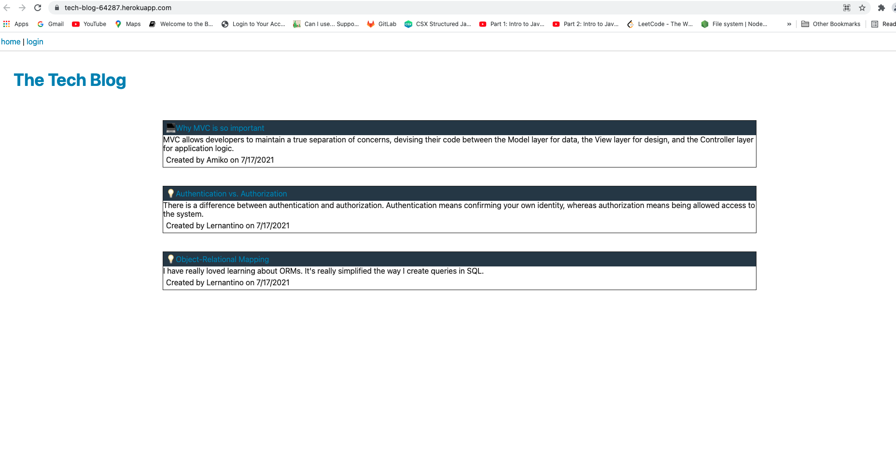

# Tech-Blog

Tech-Blog app allows users to share, update and delete their posts. This app also allows the users to make comments on the other users' posts. (Comments are still work in progress.)

## Getting Started

clone me, or fork me

🌎 live on [heroku](https://tech-blog-64287.herokuapp.com/)

Screen shot of the deployed app: 

## Deployment
just deploy, no other actions needed

## Build With 

* [Sequelize ORM](https://sequelize.org/master/identifiers.html)
* [Handlebars](https://handlebarsjs.com/)
* [JavaScript (JS)](https://developer.mozilla.org/en-US/docs/Web/JavaScript)
* [Bootstrap](https://getbootstrap.com/)
* [jQuery](https://jqueryui.com/autocomplete/)
* [CSS](https://developer.mozilla.org/en-US/docs/Web/CSS)
* [Node.js](https://nodejs.dev/learn/writing-files-with-nodejs)
* [mysql2](https://www.npmjs.com/package/mysql2)
* [MySQL](https://dev.mysql.com/)

## Acknowledgements

Billie Thompson - README template - PurpleBooth)